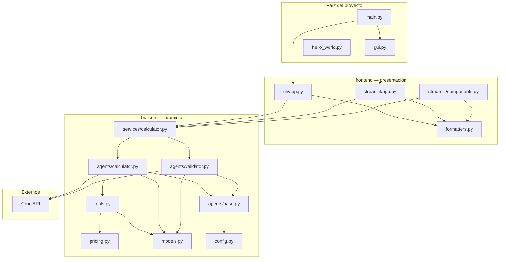
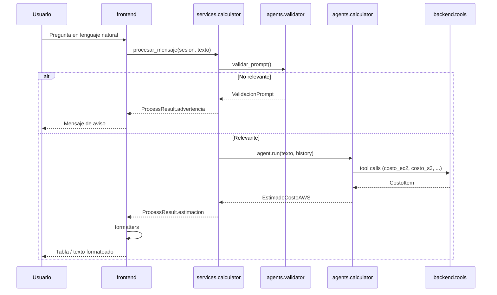

# Calculadora de costos AWS con Pydantic AI

Aplicación que estima costos de infraestructura en **AWS** a partir de preguntas en lenguaje natural. Un agente de [Pydantic AI](https://ai.pydantic.dev/) interpreta la solicitud, invoca herramientas de precios y devuelve un desglose estructurado (`EstimadoCostoAWS`). Incluye interfaz de **línea de comandos** y **interfaz web** con Streamlit.

## Características

- Agente con **tool calling** para calcular costos por servicio AWS
- Salida tipada con **Pydantic** (ítems, totales mensual/anual, notas)
- **CLI** y **GUI** comparten la misma lógica de negocio (`backend/services/calculator.py`)
- Arquitectura en capas: **backend** (dominio y agentes) y **frontend** (presentación)
- Validación de prompts para rechazar preguntas fuera de tema
- Historial de conversación dentro de cada sesión

### Servicios AWS soportados

| Herramienta | Servicio |
|-------------|----------|
| `costo_ec2` | EC2 |
| `costo_rds` | RDS |
| `costo_elasticache` | ElastiCache (Redis/Memcached) |
| `costo_s3` | S3 |
| `costo_transferencia_datos` | Transferencia de datos saliente |
| `costo_lambda` | Lambda |
| `costo_api_gateway` | API Gateway |
| `costo_dynamodb` | DynamoDB |
| `costo_sns` | SNS |
| `costo_sqs` | SQS |

## Stack tecnológico

| Tecnología | Uso |
|------------|-----|
| **Python 3.10+** | Lenguaje base |
| **Pydantic AI** (`pydantic-ai-slim[groq]`) | Agente, tools y proveedor LLM |
| **Groq** (`llama-3.3-70b-versatile`) | Modelo de lenguaje |
| **Pydantic** | Modelos y validación de salida |
| **Streamlit** | Interfaz gráfica |
| **python-dotenv** | Variables de entorno (`GROQ_API_KEY`) |

## Arquitectura

El código se organiza en dos capas con dependencia unidireccional:



| Regla | Descripción |
|-------|-------------|
| **Frontend → Backend** | `frontend/` solo importa desde `backend/`. Nunca al revés. |
| **Sin UI en backend** | `backend/` no importa Streamlit ni código de terminal. |
| **Punto único de orquestación** | Toda petición del usuario pasa por `procesar_mensaje()` en `backend/services/calculator.py`. |
| **Precios estáticos** | Los cálculos numéricos viven en `pricing.py` + `tools.py`; el LLM elige qué tools llamar. |

## Mapa del código

Árbol completo con el rol de cada archivo. Úsalo como índice para navegar el repositorio.

```
pydantic-ai/
│
├── main.py                      # Dispatcher: carga .env, CLI o lanza Streamlit (--gui)
├── gui.py                       # Entrada mínima Streamlit (env + run_app)
├── hello_world.py               # Demo aislada del SDK (no usa backend/frontend)
├── requirements.txt             # Dependencias Python
├── .env.example                 # Plantilla GROQ_API_KEY
│
├── backend/                     # CAPA DE DOMINIO
│   ├── __init__.py              # API pública: crear_sesion, procesar_mensaje, modelos…
│   ├── config.py                # PROJECT_ROOT, GROQ_MODEL_NAME, load_environment()
│   ├── models.py                # CostoItem, EstimadoCostoAWS, ValidacionPrompt
│   ├── pricing.py               # Diccionarios y constantes USD (us-east-1)
│   ├── tools.py                 # Funciones @tool para el agente + ALL_TOOLS
│   │
│   ├── agents/
│   │   ├── __init__.py
│   │   ├── base.py              # crear_modelo_groq() — factory compartida
│   │   ├── calculator.py        # Agente principal + SYSTEM_PROMPT + crear_agente()
│   │   └── validator.py         # Agente clasificador + validar_prompt()
│   │
│   └── services/
│       ├── __init__.py
│       └── calculator.py        # CalculatorSession, ProcessResult, procesar_mensaje()
│
└── frontend/                    # CAPA DE PRESENTACIÓN
    ├── __init__.py
    ├── formatters.py            # Texto plano y filas para tablas Streamlit
    │
    ├── cli/
    │   ├── __init__.py          # exporta run
    │   └── app.py               # Bucle input/print de terminal
    │
    └── streamlit/
        ├── __init__.py          # exporta run_app
        ├── app.py               # Página principal, chat_input, session_state
        └── components.py        # Sidebar, historial, métricas y dataframe
```

### Puntos de entrada

| Archivo | Comando | Qué hace |
|---------|---------|----------|
| [`main.py`](main.py) | `python main.py` | Ejecuta la CLI (`frontend.cli.app.run`) |
| [`main.py`](main.py) | `python main.py --gui` | Lanza Streamlit sobre [`gui.py`](gui.py) |
| [`gui.py`](gui.py) | `streamlit run gui.py` | Carga entorno y llama `frontend.streamlit.app.run_app` |
| [`hello_world.py`](hello_world.py) | `python hello_world.py` | Chat de prueba sin calculadora AWS |

---

## Especificación por carpeta

### Raíz (`/`)

| Archivo | Responsabilidad | Dependencias clave |
|---------|-----------------|-------------------|
| `main.py` | Argumentos CLI/GUI; carga `.env` al importar | `backend.config`, `frontend.cli` |
| `gui.py` | Wrapper de una línea para Streamlit | `backend.config`, `frontend.streamlit.app` |
| `hello_world.py` | Ejemplo independiente de Pydantic AI + Groq | Solo `pydantic_ai`, `dotenv` |
| `.env.example` | Documenta la variable `GROQ_API_KEY` requerida | — |

---

### `backend/` — Lógica de negocio

Paquete sin dependencias de UI. Contiene modelos, precios, agentes LLM y la orquestación de sesiones.

#### `backend/config.py`

| Elemento | Descripción |
|----------|-------------|
| `PROJECT_ROOT` | Ruta a la raíz del repo (para localizar `.env`) |
| `GROQ_MODEL_NAME` | Modelo por defecto: `llama-3.3-70b-versatile` |
| `DEFAULT_REGION` | Región AWS por defecto: `us-east-1` |
| `load_environment()` | Carga `PROJECT_ROOT/.env` con `python-dotenv` |

#### `backend/models.py`

| Modelo | Campos relevantes | Uso |
|--------|-------------------|-----|
| `CostoItem` | servicio, descripción, cantidad, costos | Un recurso AWS en el desglose |
| `EstimadoCostoAWS` | items, total_mensual, total_anual, region, notas | Salida estructurada del agente principal |
| `ValidacionPrompt` | es_relevante, categoria, mensaje | Salida del agente validador |

Categorías del validador: `aws_costos`, `off_topic`, `ambiguo`.

#### `backend/pricing.py`

Tablas y constantes en USD (referencia aproximada, región us-east-1):

- `PRECIOS_EC2_US_EAST_1`, `PRECIOS_RDS_US_EAST_1`, `PRECIOS_ELASTICACHE`
- Constantes unitarias: S3, transferencia, Lambda, API Gateway, DynamoDB, SNS, SQS, storage RDS

**No** llama a APIs de AWS; son datos estáticos editables.

#### `backend/tools.py`

Funciones registradas como tools del agente. Cada una:

1. Lee precios de `pricing.py`
2. Devuelve un `CostoItem`

Lista exportada: `ALL_TOOLS` (9 herramientas, ver tabla de servicios arriba).

#### `backend/agents/`

| Archivo | Rol |
|---------|-----|
| `base.py` | `crear_modelo_groq()` — evita duplicar configuración del modelo |
| `calculator.py` | Agente con `ALL_TOOLS`, `SYSTEM_PROMPT` y `output_type=EstimadoCostoAWS` |
| `validator.py` | Agente sin tools; clasifica prompts; `validar_prompt()`, `mensaje_advertencia()` |

#### `backend/services/calculator.py`

**Núcleo de la aplicación.** API que consumen CLI y Streamlit:

| Símbolo | Tipo | Descripción |
|---------|------|-------------|
| `CalculatorSession` | dataclass | Agente + validador + `history` (mensajes Pydantic AI) |
| `ProcessResult` | dataclass | `ok`, `estimacion`, `advertencia`, `error` |
| `crear_sesion()` | función | Instancia agentes e historial vacío |
| `procesar_mensaje(sesion, texto)` | async | Valida → ejecuta agente → actualiza historial |
| `reiniciar_sesion(sesion)` | función | Limpia `history` (botón “Nueva conversación” en GUI) |

Flujo interno de `procesar_mensaje`:

1. Texto vacío → advertencia
2. `validar_prompt()` → si no es relevante → advertencia con mensaje del validador
3. `agent.run()` con tools → `EstimadoCostoAWS`
4. Excepciones → `ProcessResult.error`

#### `backend/__init__.py`

Reexporta la API pública para uso programático:

```python
from backend import crear_sesion, procesar_mensaje, EstimadoCostoAWS, load_environment
```

---

### `frontend/` — Presentación

Solo formatea y muestra resultados; no define precios ni agentes.

#### `frontend/formatters.py`

| Función | Salida | Consumidor |
|---------|--------|------------|
| `formatear_estimacion_texto()` | Tabla ASCII + totales + notas | CLI, historial de chat Streamlit |
| `estimacion_a_filas()` | `list[dict]` para `st.dataframe` | `streamlit/components.py` |

#### `frontend/cli/`

| Archivo | Contenido |
|---------|-----------|
| `app.py` | Banner, bucle `input()`, llama `procesar_mensaje`, imprime con `formatear_estimacion_texto` |
| `__init__.py` | Exporta `run` (función async del bucle) |

Comandos de salida: `salir`, `exit`, `quit`, `q`.

#### `frontend/streamlit/`

| Archivo | Contenido |
|---------|-----------|
| `app.py` | `run_app()`: page config, `session_state` (`ui_messages`, `calculator_session`), `chat_input`, `asyncio.run` por mensaje |
| `components.py` | `render_sidebar()`, `render_estimacion()`, `render_chat_history()` |

Estado en Streamlit:

- `calculator_session` → `CalculatorSession` del backend
- `ui_messages` → lista de mensajes UI (rol, contenido, estimación opcional)

---

## Flujo de una petición (secuencia)



## Requisitos previos

- Python 3.10 o superior
- Cuenta en [Groq](https://console.groq.com/) con API key
- Conexión a internet (llamadas a la API de Groq)

Se recomienda usar un entorno virtual (`.venv`).

## Instalación

```bash
git clone https://github.com/camilosuarezmora/pydantic-ai.git
cd pydantic-ai
python -m venv .venv
```

Activar el entorno virtual:

```bash
# Windows (PowerShell)
.venv\Scripts\Activate.ps1

# Windows (CMD)
.venv\Scripts\activate.bat

# Linux / macOS
source .venv/bin/activate
```

Instalar dependencias y configurar la API key:

```bash
pip install -r requirements.txt

# Windows
copy .env.example .env

# Linux / macOS
cp .env.example .env
```

Edita `.env` y define tu clave:

```env
GROQ_API_KEY=tu_clave_aqui
```

Los archivos `.env` y `.venv/` están en `.gitignore` y no deben subirse al repositorio.

> Ejecuta siempre los comandos desde la **raíz del proyecto** para que Python resuelva los paquetes `backend` y `frontend`.

## Ejecución

### CLI interactiva

```bash
python main.py
```

**Ejemplos de preguntas:**

- ¿Cuánto cuestan 3 instancias t3.medium?
- Necesito 1 RDS db.t3.small con 100 GB de storage
- Calcula: 2× t3.micro, 50 GB S3, 1 RDS t3.small
- App con Lambda + API Gateway + DynamoDB

### Interfaz gráfica (Streamlit)

```bash
python main.py --gui
# o
streamlit run gui.py
```

Se abrirá la calculadora en el navegador (por defecto en `http://localhost:8501`).

### Ejemplo mínimo (opcional)

[`hello_world.py`](hello_world.py) es un chat sencillo con Pydantic AI y Groq, **sin** herramientas ni lógica AWS:

```bash
python hello_world.py
```

## Dónde empezar a leer el código

| Si quieres… | Empieza por… |
|-------------|--------------|
| Entender el flujo completo | [`backend/services/calculator.py`](backend/services/calculator.py) |
| Ver cómo se calcula un precio | [`backend/tools.py`](backend/tools.py) → [`backend/pricing.py`](backend/pricing.py) |
| Cambiar el comportamiento del LLM | [`backend/agents/calculator.py`](backend/agents/calculator.py) |
| Ajustar qué preguntas se aceptan | [`backend/agents/validator.py`](backend/agents/validator.py) |
| Modificar la terminal | [`frontend/cli/app.py`](frontend/cli/app.py) |
| Modificar la web | [`frontend/streamlit/app.py`](frontend/streamlit/app.py) |
| Cambiar cómo se muestran los totales | [`frontend/formatters.py`](frontend/formatters.py) |
| Añadir una nueva UI (p. ej. FastAPI) | Crea módulo en `frontend/` que llame solo a `procesar_mensaje` |

## Limitaciones y avisos

- Los precios son **aproximados** y se basan en tablas estáticas en `backend/pricing.py`.
- Por defecto se usa la región **us-east-1** (N. Virginia) salvo que indiques otra en la pregunta.
- **No** se incluyen impuestos, AWS Free Tier, Reserved Instances ni descuentos por volumen.
- Las estimaciones no sustituyen la [Calculadora de precios de AWS](https://calculator.aws/) ni facturación real.
- La aplicación requiere acceso a la **API de Groq**; sin `GROQ_API_KEY` válida no funcionará el agente.

## Referencias

- [Documentación de Pydantic AI](https://ai.pydantic.dev/)
- [Groq Console](https://console.groq.com/)
- [AWS Pricing](https://aws.amazon.com/pricing/)

## Licencia

Este repositorio no incluye un archivo de licencia explícito. Consulta al autor antes de reutilizar el código en otros proyectos.
